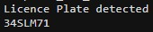

# License Plate Detection and Recognition

## Step 1: Read the Image
The code begins by reading an image file. (Adjust the Image path)

## Step 2: Preprocess the Image
1. **Convert to Grayscale:** The image is converted to grayscale.
2. **Gaussian Smoothing:** A Gaussian filter is applied to reduce noise.
3. **Contrast Enhancement:** The contrast of the image is enhanced.
4. **Adaptive Thresholding:** The image is binarized using adaptive thresholding.
5. **Hole Filling:** Holes in the binary image are filled.
6. **Remove Small Objects:** Small objects in the binary image are removed.
7. **Edge Detection:** Canny edge detection is applied.

## Step 3: Find Connected Components
Connected components in the edge-detected image are identified.

## Step 4: Filter Connected Components
Connected components are filtered based on area, aspect ratio, and intensity. The filtering criteria are adjustable.

## Step 5: Display the Original Image with Detected Rectangle
The original image is displayed with rectangles drawn around the detected license plate candidates.

## Step 6: Process the Detected Rectangles
For each detected rectangle:
1. **Crop the Region of Interest (ROI):** The region within the rectangle is cropped from the original image.
2. **ROI Preprocessing:** Similar preprocessing steps are applied to the cropped region.
3. **OCR on the ROI:** Optical Character Recognition (OCR) is performed on the preprocessed ROI using the MATLAB OCR function.
4. **Filter Characters:** Characters that do not belong to a specified set (digits and uppercase letters) are filtered out.
5. **Display the Result:** The filtered license plate text is displayed.

## Summary
The code takes an image, preprocesses it, detects potential license plate candidates, filters based on certain criteria, and performs OCR to recognize the license plate text. The filtered text is then displayed for each detected license plate. The code is structured and allows for adjusting various parameters for optimization. Additionally, it utilizes MATLAB's built-in functions for image processing and OCR.

## Examples

 | 
--- | ---
 | 
